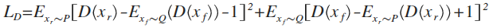
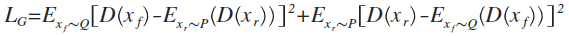
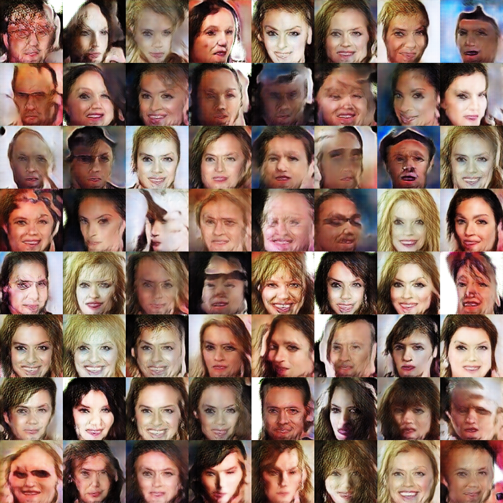
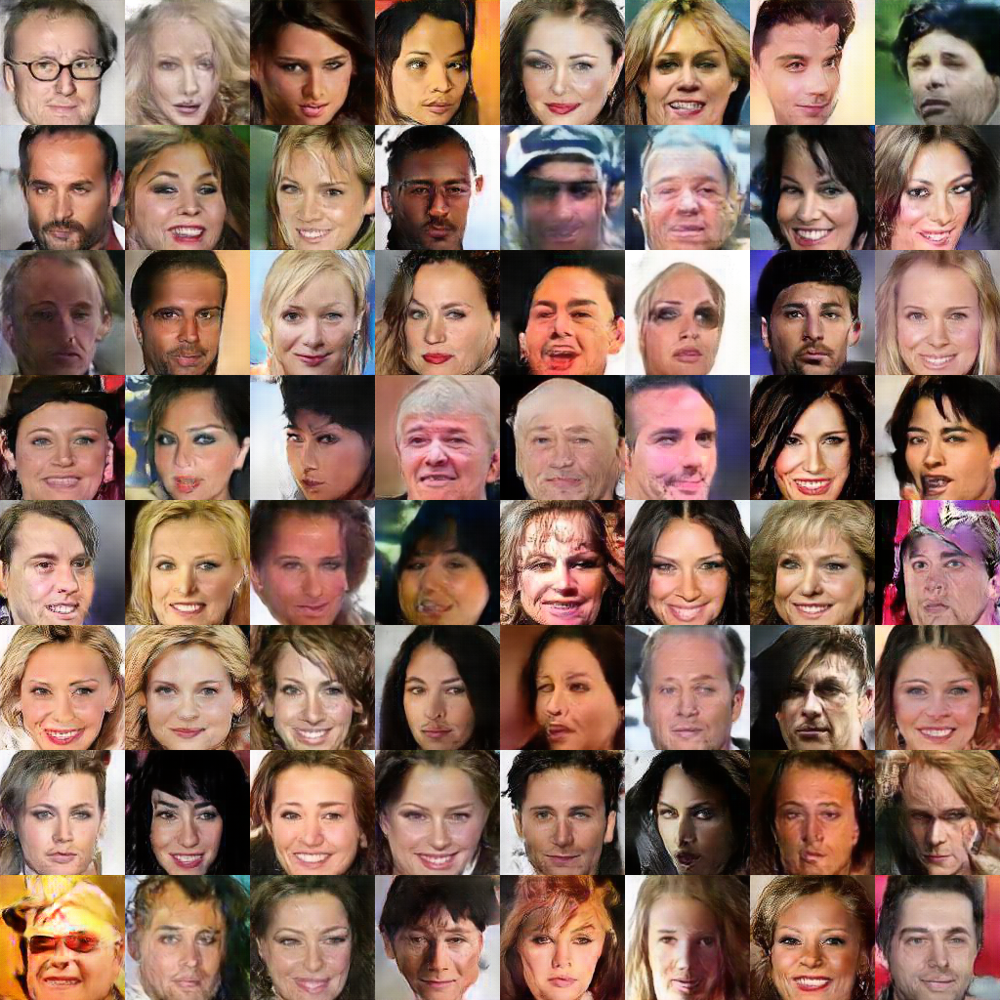
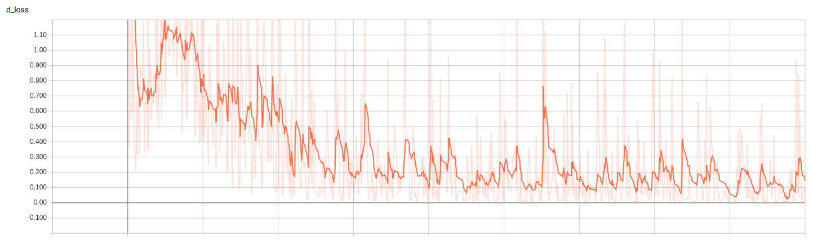
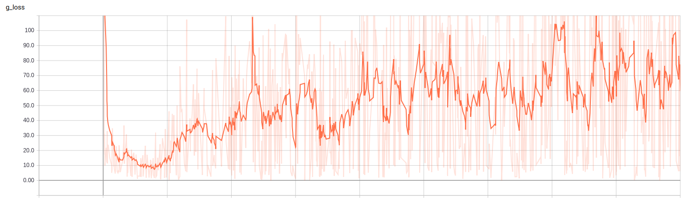

# GAN-celebA

Tensorflow implementation of GAN on Dataset [CelebA](http://mmlab.ie.cuhk.edu.hk/projects/CelebA.html).

## Model architecture

Generator|Discriminator
|:---------:|:-------------:|
z, 256|x, 128\*128\*3
fc, 8\*8\*256, BN|5\*5 conv, 64, st.2
5\*5 deconv, 256, st.2, BN|5\*5 conv, 128, st.2, BN
5\*5 deconv, 256, st.1, BN|5\*5 conv, 256, st.2, BN
5\*5 deconv, 256, st.2, BN|5\*5 conv, 512, st.2, BN
5\*5 deconv, 256, st.1, BN|fc, 1024
5\*5 deconv, 128, st.2, BN|fc, 1
5\*5 deconv, 64,  st.2, BN|cross entropy loss
5\*5 deconv, 3,   st.1|
l2 loss|

## Loss functions




## Prerequisites

- Python 3.3+
- [Tensorflow 1.4.0](https://www.tensorflow.org/)
- [SciPy](http://www.scipy.org/install.html)
- [pillow](https://github.com/python-pillow/Pillow)

## Usage

To train a model with dataset CelebA:
 ```
 $ python main.py
 ```

To test with an existing model:
 ```
 $ python main.py --train=False
 ```

## Results

After 1th epoch|After 20th epoch
|:-------------:|:--------------:|
|

## Training details

Details of the loss of Discriminator and Generator.





## Folder structure

The following shows basic folder structure.
```
├── main.py # gateway
├── data
│   ├── celebA # celebA data (not included in this repo)
│       ├── xxxx.jpg
│       ├── xxxx.jpg
│       ├── xxxx.jpg
│       └── xxxx.jpg
├── GAN.py # build GAN
├── model.py # Generator and Discriminator
├── ops.py # some operations on layer
├── utils.py # utils
├── logs # log files for tensorboard to be saved here
└── checkpoint # model files to be saved here
```

## Acknowledgements

This implementation has been based on [this repository](https://github.com/carpedm20/DCGAN-tensorflow) and tested with Tensorflow 1.4.0 on Ubuntu 16.04(GeForce GTX 1080 Ti).

## Author

Cong Yu / [@congyucn](https://congyucn.github.io/)
